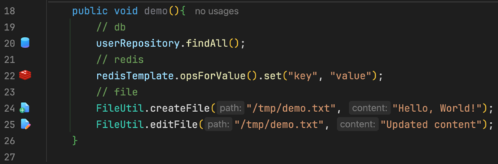

    

<h1 align="center">Intellij Code Marker</h1>

 

> Jetbrains Marketplace: 

<b>Intellij Code Marker</b> is a developer productivity plugin for IntelliJ IDEA that brings clarity to complex codebases.
It enables you to define custom markers for specific classes or methods by assigning meaningful icons—making key parts of your code instantly recognizable.

With intuitive visual cues embedded directly into the editor, Intellij Code Marker helps you identify important components at a glance, streamline navigation, and better understand your project’s structure.

## 🔧 Key Features

### 🎯 Custom Highlight Rules
Easily create rules by entering any class or method name and selecting an icon from a built-in icon set. 
Once set, the plugin automatically highlights matching elements in the editor.
 

### 👁️ Visual Indicators in the Editor Gutter
Icons appear in the left gutter of the editor, right next to the corresponding code.
This makes it easy to visually scan and spot critical parts of your application without having to read every line.
 

### 💬 Descriptive Tooltips
Hover over an icon in the gutter to display a tooltip with a custom description.
This gives you helpful context about the marked element’s role or purpose.
 

